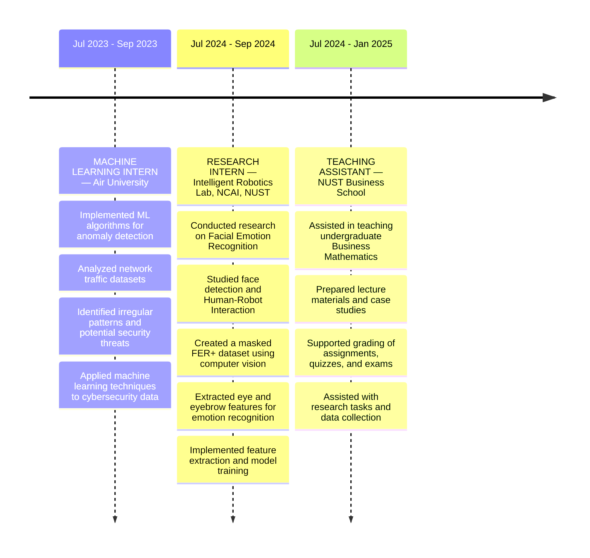
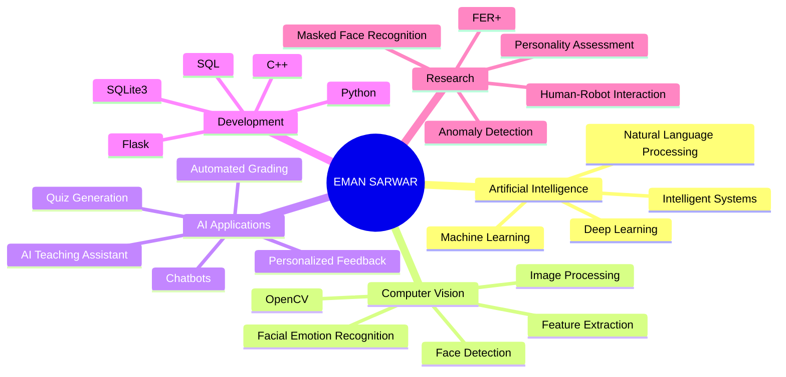

<div align="center">


<a href="https://git.io/typing-svg">
  
</a>

<br/><br/>

<p>
  
  
  
</p>


</div>

<br/>

--- 

## 🚀 Featured Projects

<table>
<tr>
<td width="50%" valign="top">

### 🤖 AI-Based Teaching Assistant

`Python` `Flask` `Llama 3.2` `Ollama` `SQLite3`

An AI-powered teaching assistant chatbot developed as my Final Year Project.

* Automated quiz and assignment generation
* Automated grading support
* Personalized student feedback
* Context-aware educational responses
* Prompt engineering and backend APIs
* Web-based educational interface

[](https://github.com/)

</td>

<td width="50%" valign="top">

### 😀 Masked Facial Emotion Recognition

`Python` `Computer Vision` `Deep Learning` `FER+` `OpenCV`

Research project focused on emotion recognition from partially occluded faces.

* Created a masked FER+ dataset
* Applied masks to facial images using computer vision
* Extracted eye and eyebrow features
* Investigated facial emotion recognition under occlusion
* Implemented feature extraction and model training

[](#)

</td>
</tr>

<tr>

<td width="50%" valign="top">

### 🔍 Network Anomaly Detection

`Python` `Machine Learning` `Data Analysis`

Machine learning internship project focused on identifying irregular patterns in network traffic.

* Implemented ML algorithms for anomaly detection
* Analyzed large-scale network traffic datasets
* Identified irregular patterns and potential security threats
* Applied machine learning techniques to cybersecurity data

[](#)

</td>

<td width="50%" valign="top">

### 🧠 Intelligent AI Systems

`Machine Learning` `Deep Learning` `Computer Vision`

A growing collection of AI projects exploring intelligent systems across machine learning and deep learning.

* Model development and experimentation
* Computer vision applications
* Deep learning workflows
* AI-powered applications
* Research-driven problem solving

[](https://github.com/)

</td>

</tr>
</table>

---

## 🗂️ WORK // RESEARCH OPERATIONS

<div align="center">

# FIELD DOSSIER // CAREER LOG

</div>

<br>



---

## 🧠 AI // RESEARCH // ENGINEERING



---

## 🌱 Current Focus

| Area                           | Details                                                             |
| :----------------------------- | :------------------------------------------------------------------ |
| 🤖 **Artificial Intelligence** | Building intelligent systems and practical AI applications          |
| 🧠 **Machine Learning**        | Developing and experimenting with ML models for real-world problems |
| 👁️ **Computer Vision**         | Facial emotion recognition, face detection, and image-based AI      |
| 🔥 **Deep Learning**           | Exploring neural networks and deep learning architectures           |
| 💬 **AI Applications**         | LLM-powered assistants, chatbots, and context-aware systems         |
| 🔬 **AI Research**             | Exploring computer vision, HRI, and intelligent systems             |

---

## 🛠️ Tech Arsenal

<div align="center">

**Programming & Data**<br/>


<br/><br/>

**AI & Machine Learning**<br/>


&nbsp;


<br/><br/>

**Computer Vision**<br/>


<br/><br/>

**Backend & AI Applications**<br/>


&nbsp;


<br/><br/>

**Databases & Tools**<br/>


</div>

---

## 🏆 Honours & Achievements

> ### 🥇 Certificate of Merit — Air University
>
> **Achievement:** Ranked highest in the cohort and secured **1st position in the entire BS Artificial Intelligence program** based on overall academic performance.

> ### 💻 2021 Hackathon Competition — Air University
>
> **Achievement:** Achieved **Top 10 position** in a coding hackathon involving real-world C++ programming problems.

---

## 🎓 Education

### 🎓 Bachelor of Science in Artificial Intelligence

**Air University**
📍 Islamabad, Pakistan
📅 September 2021 — July 2025

Focused on Artificial Intelligence, Machine Learning, Deep Learning, Computer Vision, and intelligent systems.

---

## 🔬 Research Interests

```text
┌───────────────────────────────────────────────────────┐
│                                                       │
│   COMPUTER VISION        FACIAL EMOTION RECOGNITION   │
│                                                       │
│   DEEP LEARNING          HUMAN-ROBOT INTERACTION      │
│                                                       │
│   INTELLIGENT SYSTEMS    NATURAL LANGUAGE PROCESSING  │
│                                                       │
│   AI APPLICATIONS        MACHINE LEARNING             │
│                                                       │
└───────────────────────────────────────────────────────┘
```

---

## 💬 Let's Connect

<div align="center">

<a href="http://linkedin.com/in/eman-sarwar-ba8709256">

</a>

<a href="mailto:emansarwar832@gmail.com">

</a>

<a href="https://github.com/YOUR_GITHUB_USERNAME">

</a>

<br/><br/>

*Open to AI/ML collaborations, research opportunities, and building intelligent systems.*

<br/>


</div>
